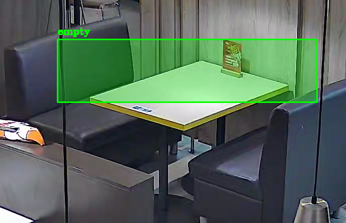
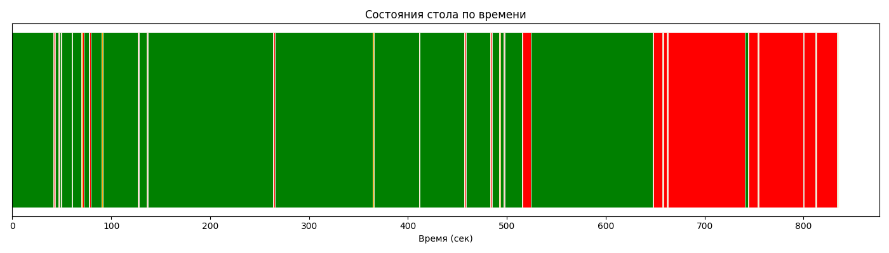
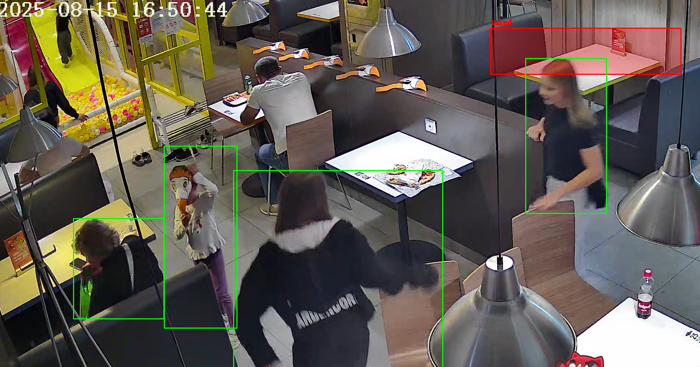
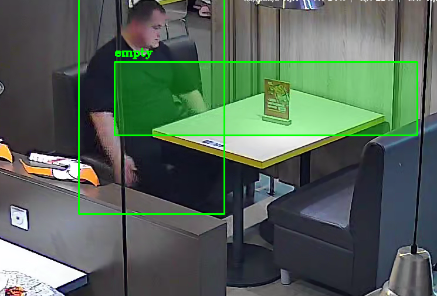

# Прототип системы детекции уборки столиков по видео

## Быстрый старт

Установка PyTorch с поддержкой CUDA (рекомендуется):
```bash
pip install torch torchvision --index-url https://download.pytorch.org/whl/cu121
```
Установка остальных зависимостей и запуск
```bash
pip install -r requirements.txt
python main.py --video video1.mp4
```

По умолчанию порог уверенности модели — 0.5. Можно изменить:
```bash
python main.py --video video1.mp4 --conf 0.6
```

После запуска появится окно с первым кадром видео — надо выделить зону столика мышью и нажать **Enter**.

## Зависимости

```
ultralytics
opencv-python
pandas
matplotlib
torch
torchvision
```


## Выбранное видео и столик

- Видео: `video1.mp4`
- Столик: правый в верхнем углу:



- ROI задаётся вручную через `cv2.selectROI` при каждом запуске

## Логика детекции событий

**Модель:** YOLOv11m (`yolo11m.pt`) — детектирует людей (class_id = 0) с порогом уверенности назначенным пользователем через `--conf` или 0.4 по умолчанию

**Определение состояния стола:** на каждом кадре проверяется пересечение bbox любого из задетектированных людей с зоной ROI стола. Если пересечение есть — стол считается занятым.

**Три состояния:**
- `empty` — в зоне стола нет людей
- `arrived` — человек появился в зоне после периода пустоты
- `taked` — стол занят

## Результаты

| Метрика | Значение |
|---|---|
| Среднее время пустого стола | `TODO сек (TODO мин)` |
| Среднее время занятого стола | `TODO сек (TODO мин)` |

А также небольшая визуализация изменения состояния рассматриваемоего столика


## Пример проблемного кадра



`Проходящие мимо люди попадают в кадр и срабатывает смена состояния`



`Также, иногда модель теряет детекцию на несколько кадров, и состояние столика меняется на "пустое"`


## Структура проекта

```
.
├── data/            # Папка с видео
├── main.py          # Основной скрипт
├── requirements.txt
├── README.md
├── output.mp4       # Выходное видео с визуализацией
├── timeline.png     # График состояний стола
└── report.txt       # Лог событий и статистика
```

## Выводы:
1. Не смотря на то, что в ТЗ было сказано использовать простую модель для детекции, для улучшения качества я решил использовать YOLO11m на CUDA после экспериментов с YOLO11n, для улучшения качества детекции БЕЗ дообучения
2. Даже самое простое дообучение модели на детекцию людей, ЗНАЧИТЕЛЬНО повысит качество детекции
3. Благодаря использованию классов, можно легко масштабировать решение на несколько столиков сразу